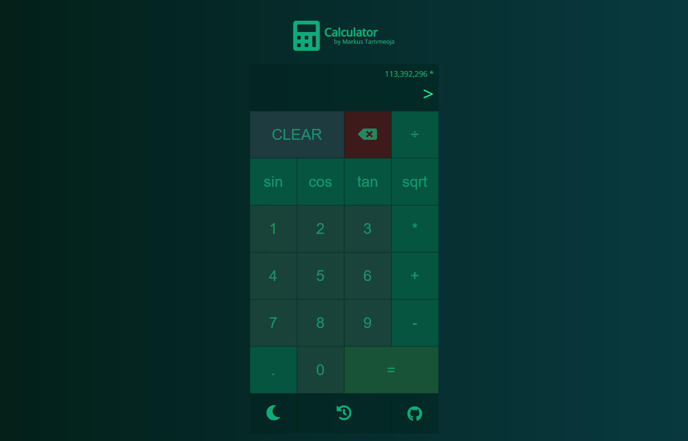
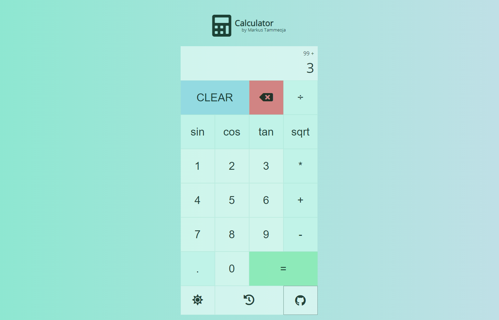
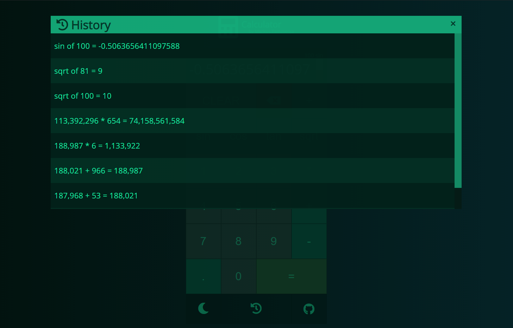
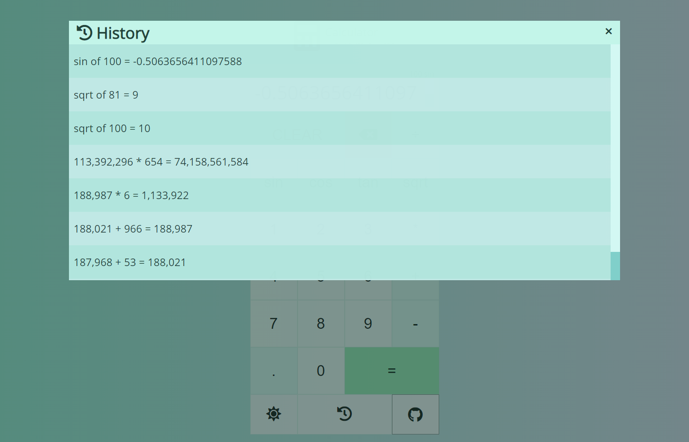

# Markus Tammeoja

Olen koostanud väikse Flappy Bird-laadse mängu. Võttis palju rohkem aega, kui arvasin, aga LÕPUKS sain siiski tööle (async JS tund oleks väga kasulik :D)

Kõik resurssi allikad on mängu veebilehel. Mõned joonistasin ise (raudkang).

### Live link:

- [Demo](http://www.tlu.ee/~dr1nky/calculator/)

### Kasutatud õpetus
- [Youtube - kalkulaatori loogika](https://www.youtube.com/watch?v=j59qQ7YWLxw)
- [w3schools - modali tegemise värskendus](https://www.w3schools.com/howto/howto_css_modals.asp)

### Funktsionaalsus

- Kalkulaator töötab
- Öö- ja päeva režiim
- Ajaloo funktsionaalsus (sama sessiooni jooksul)
- Ees- ja perekonnanimi + repo link

### Muud

- Lisaks õpetusele tegin sin, cos, tan ja ruutjuure arvutamise
- Kui sisend on tühi, siis vilkub ">"
- Kasutatud Font Awesome ikoonide jaoks

### Pildid

