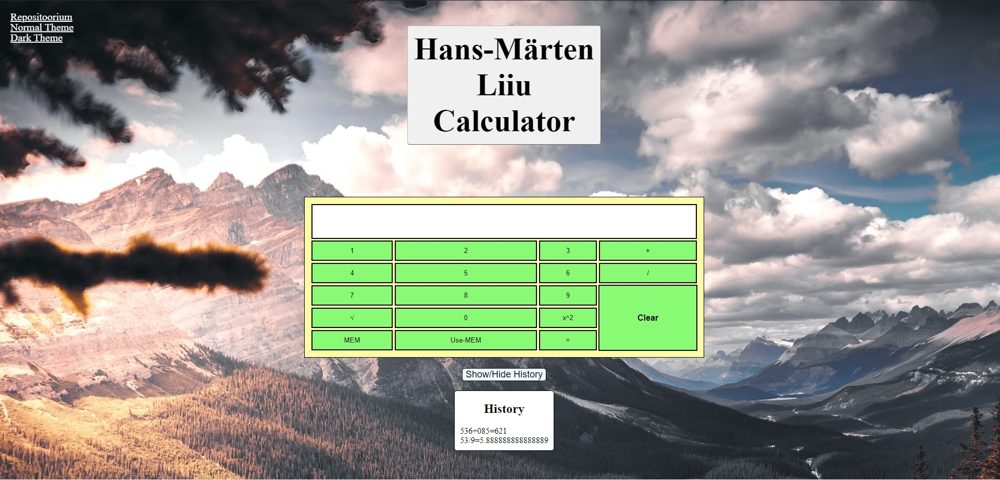
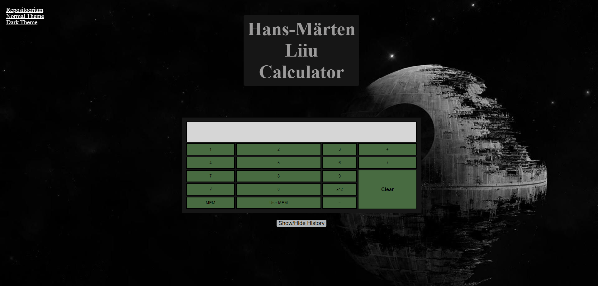

# Autor: Hans-Märten Liiu
 [http://tlu.ee/~hm4543/3-kodutoo](http://tlu.ee/~hm4543/3-kodutoo)

Võtsin aluseks koodi, mille leitsin sellelt leheküljelt: https://jsfiddle.net/2y9qfwxn/2/

## Funktsionaalsused
* ÖÖ ja Päeva reziimid, mida saab valida ülevalt vasakult klopsates lingile.
* Tavaline kalkulaator, suudab lahendada kergemad tehted.
* Ruutjuure funktsioon, milleks tuleb esmalt sisestada arv ja siis alles ruutjuur.
* Ruudu võtmis funktsioon, milleks tuleb sisestada koigepealt arv ja siis see voetakse ruutu.
* Mälufunktsioon, millega saab hetkel oleva väärtuse mällu panna, et seda hiljem kasutada.
* Ajaloo funktsioon, mida saab ka peita.

## Kuvatõmmised

