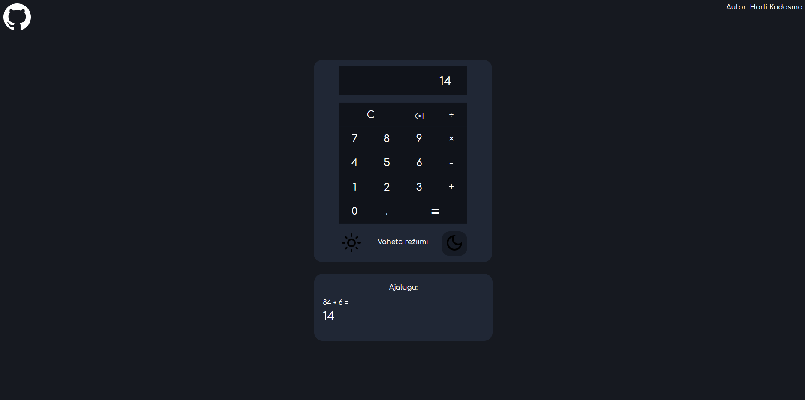
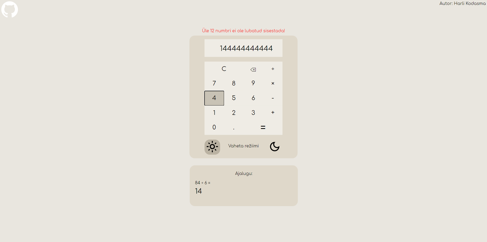
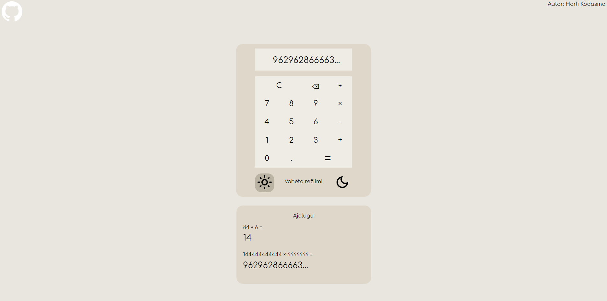

# 3. kodutöö

## Autor ja veebileht

Autor: Harli Kodasma  
Rakendus on kättesaadav siin: http://www.tlu.ee/~harli17/eesrakendused/kodutoo3/

## Funktsionaalsus

* Öö- ja päevarežiimi vahetus kahe eraldi nupuga (default on öörežiim)
* Mõlemad režiimis igast nupust üle hoverimine muudab selle stiili
* Ajaloo funktsionaalsus kalkulaatori all olevas kastis, mis expandib allapoole
* Arvude ja tehtemärkide sisestamine toimib nii Numpadiga kui ka ülemise numbrireaga klaviatuuril
* Üle 12 numbri ei ole võimalik korraga sisestada, sellisel juhul kuvatakse veateade üles keskele mis ise fadeoutib. Kui tehte vastus on üle 12 numbri, siis kuvatakse esimesed 12 numbrit ning nende lõppu ... (kõik on nähtav ka ekraanipiltidel)
* Githubi logo üleval vasakul viib rakenduse repositooriumisse
* Katkiseid tehteid sisestades ei lähe leht katki (näiteks sisestades ainult tehtemärgi ja vajutades võrdusmärki; sisestades ainult arvu ja tehtemärgi ning siis vajutades võrdusmärki jne)

## Märkus

Ei kasutanud kalkulaatori loomisel ühtegi tutorialit, nii JS kui CSS on ise nullist tehtud (välja arvatud erinevad StackOverflow threadid jms allikad kust sai probleemide korral abi)

## Ekraanipildid rakendusest

### Vaade öörežiimis peale tehte arvutamist

### Vaade päevarežiimis kui sisestada üle 12 numbri korraga

### Vaade päevarežiimis kui arvutada tehet mille vastus on üle 12 numbri pikk

